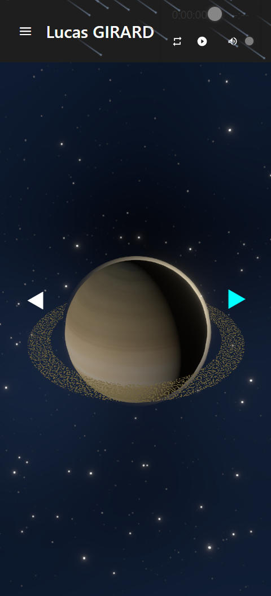

# Three Js Portfolio template

A portfolio made on react using three js (react-three fiber), based on the solar system


## Authors

- [@lululazone](https://github.com/lululazone)


## Screenshots





## Features

- 3d planets and sun
- Nice shader (stars, atmosphere etc...)
- Radio stream
- Stylised pages
- Almost fully responsive (some pages need to be changed)
- A GPU burning x)


## Demo
See it in action here:
https://portfolio.gplaystudio.online/


## Installation

Install the app with npm

```bash
  cd portfoliothreejs 
  npm install

```
    
